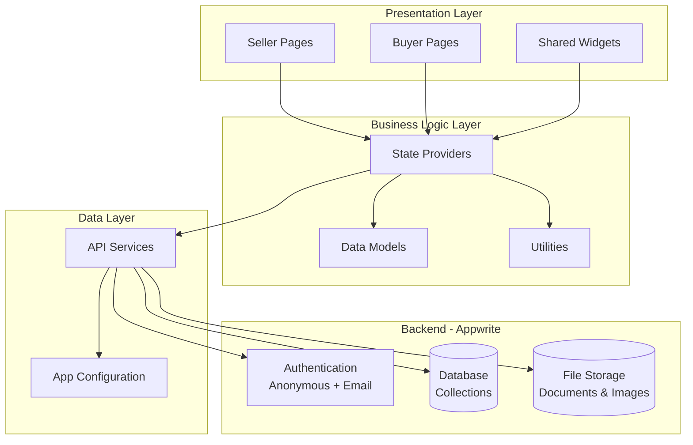
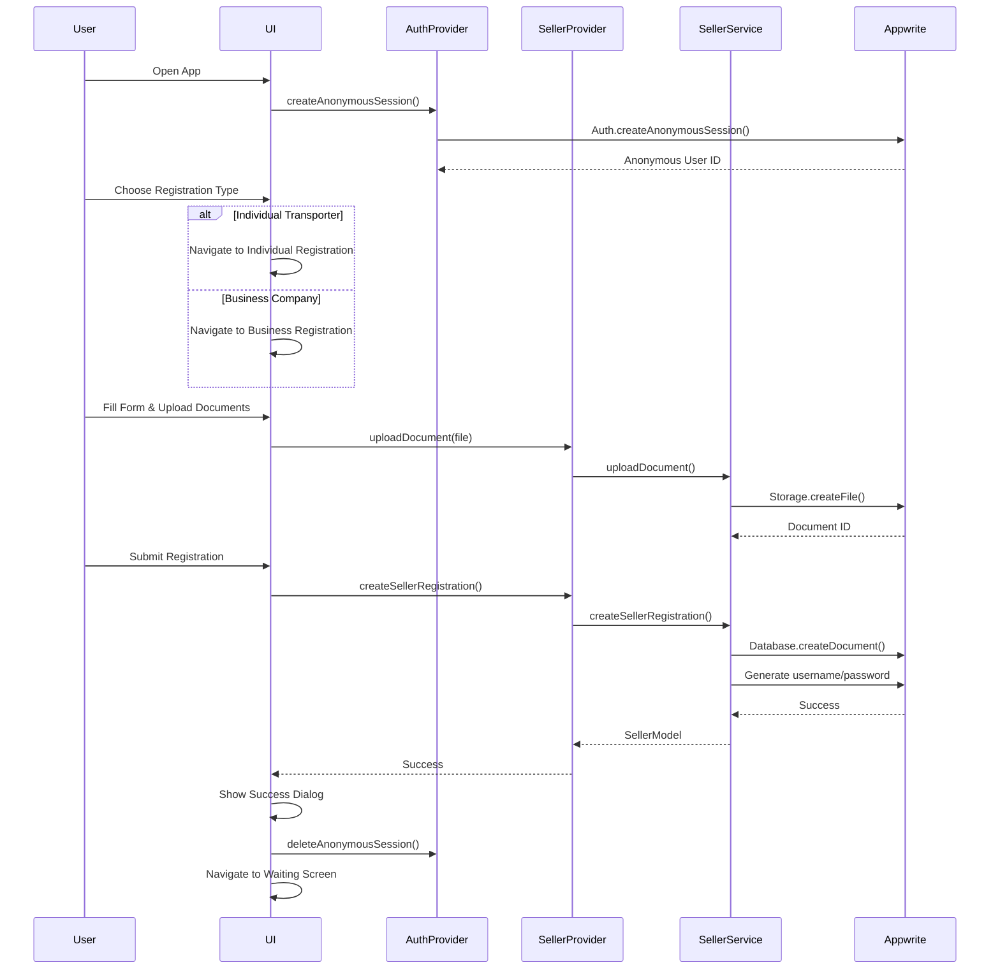
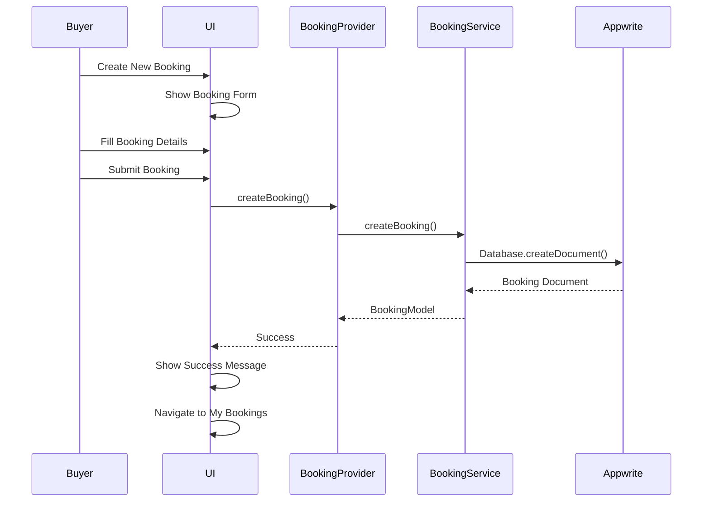
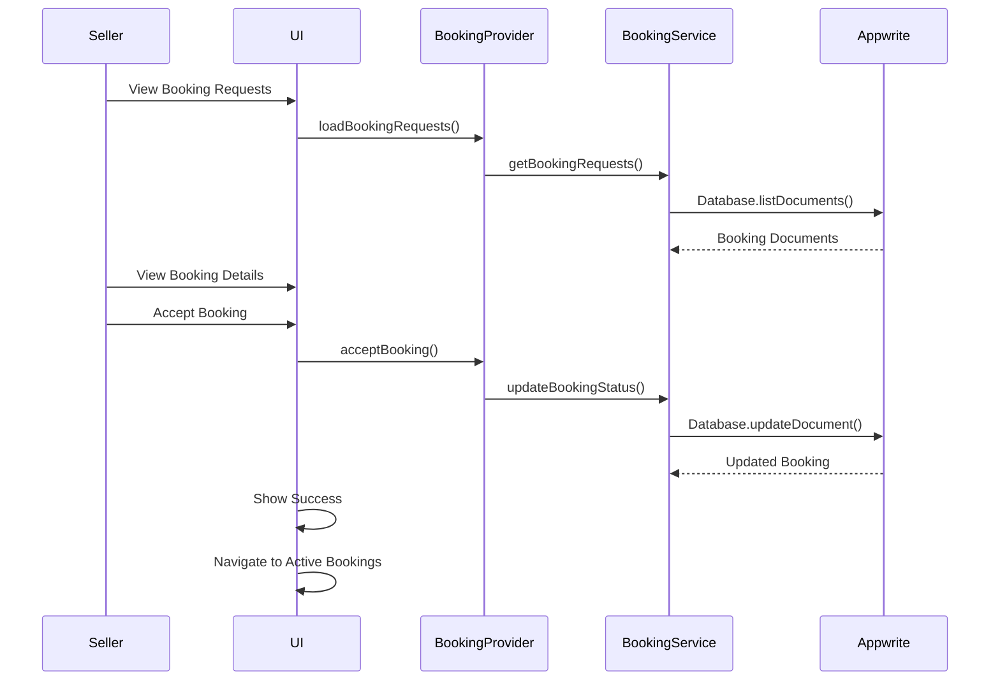
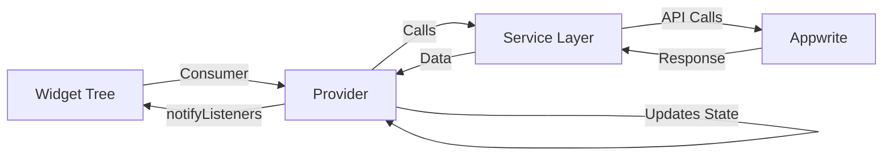
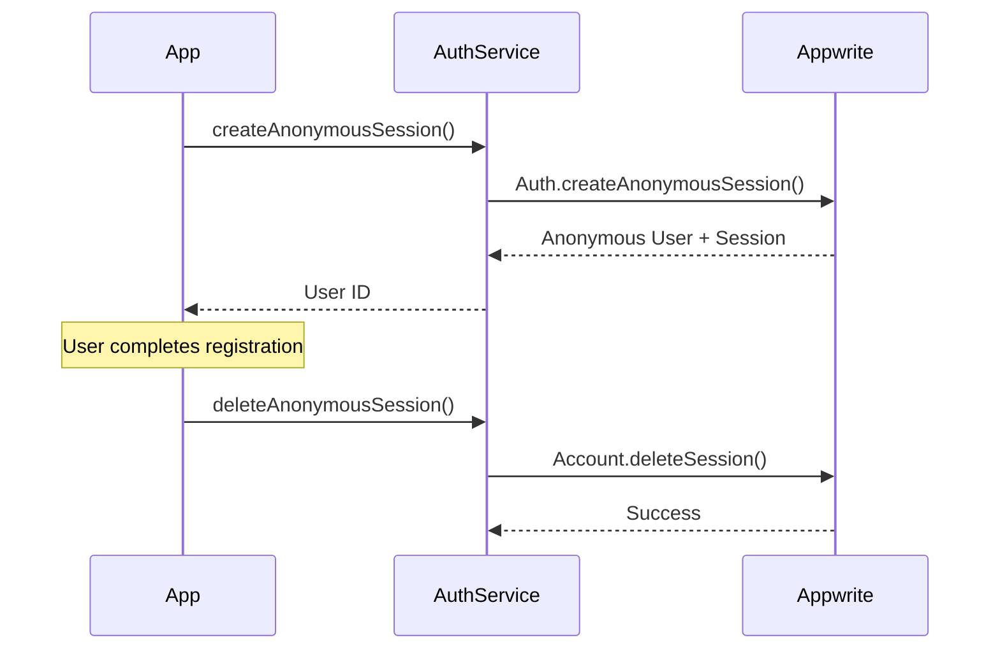
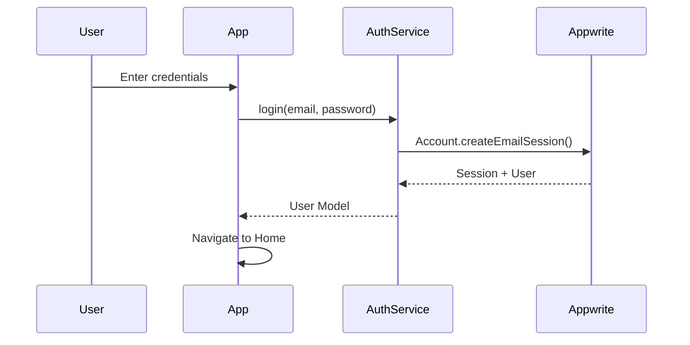

# TruckMate - Architecture Documentation

## System Overview

TruckMate is a Flutter-based mobile application that connects customers needing cargo transportation with available transporters. The app supports two user types: Sellers (Transporters) and Buyers (Customers), each with distinct workflows and features.

## Architecture Diagram



## User Flow Diagrams

### Transporter Registration Flow



### Booking Creation Flow (Customer)



### Booking Acceptance Flow (Transporter)



## Directory Structure

### `/lib` Folder Organization

```
lib/
├── components/
│   └── custom_components.dart         # Reusable UI components
├── config/
│   └── appwrite_config.dart           # Appwrite configuration
├── constants/
│   └── colors.dart                    # Color scheme
├── models/
│   ├── booking_model.dart             # Booking data model
│   ├── seller_model.dart              # Seller/Transporter model
│   ├── user_model.dart                # User account model
│   ├── vehicle_model.dart             # Vehicle information
│   └── vehicle_request_model.dart     # Vehicle addition request
├── pages/
│   ├── Seller Pages (31 files)
│   │   ├── business_registration_screen.dart
│   │   ├── seller_registration_screen.dart
│   │   ├── seller_waiting_confirmation.dart
│   │   ├── seller_home_screen.dart
│   │   ├── seller_login_screen.dart
│   │   ├── seller_profile_screen.dart
│   │   ├── my_vehicles_screen.dart
│   │   ├── add_vehicle_screen.dart
│   │   ├── seller_booking_requests_screen.dart
│   │   ├── seller_booking_detail_screen.dart
│   │   └── ... (other seller screens)
│   └── Buyer Pages
│       ├── buyer_home_screen.dart
│       ├── buyer_login_screen.dart
│       ├── create_booking_screen.dart
│       ├── my_bookings_screen.dart
│       └── ... (other buyer screens)
├── providers/
│   ├── auth_provider.dart             # Authentication state
│   ├── seller_provider.dart           # Seller operations
│   ├── booking_provider.dart          # Booking management
│   ├── buyer_provider.dart            # Buyer operations
│   ├── vehicle_provider.dart          # Vehicle management
│   ├── payment_provider.dart          # Payment tracking
│   └── location_provider.dart         # Location services
├── services/
│   ├── auth_service.dart              # Authentication API
│   ├── seller_service.dart            # Seller operations
│   ├── booking_service.dart           # Booking operations
│   ├── buyer_service.dart             # Buyer operations
│   ├── vehicle_service.dart           # Vehicle operations
│   ├── payment_service.dart           # Payment operations
│   ├── storage_service.dart           # File storage
│   ├── database_service.dart          # Generic DB operations
│   ├── notification_service.dart      # Notifications
│   ├── location_service.dart          # Location tracking
│   └── user_service.dart              # User management
├── utils/
│   ├── validators.dart                # Input validation
│   └── helpers.dart                   # Helper functions
├── widgets/
│   ├── custom_button.dart             # Reusable buttons
│   ├── custom_text_field.dart         # Text inputs
│   ├── loading_overlay.dart           # Loading indicator
│   ├── snackbar_helper.dart           # Toast messages
│   └── status_badge.dart              # Status indicators
└── main.dart                          # Application entry point
```

## File Descriptions

### Configuration (`/config`)

#### `appwrite_config.dart`
- **Purpose**: Central Appwrite backend configuration
- **Contents**:
  - Project ID, endpoint URL
  - Database and collection IDs
  - Storage bucket ID
  - API keys and secrets
- **Security**: Sensitive data should be environment-specific

### Models (`/models`)

#### `seller_model.dart`
- **Purpose**: Transporter/seller data representation
- **Key Fields**:
  - Personal info (name, contact, address, email)
  - Documents (PAN, GST, license, transport license)
  - Shop photo ID (optional)
  - Vehicle list
  - Availability status
  - Return location
  - Transporter type
- **Methods**: `fromJson()`, `toJson()`, `fromDocument()`

#### `booking_model.dart`
- **Purpose**: Booking/shipment data
- **Key Fields**:
  - Buyer and seller IDs
  - Pickup and delivery locations
  - Load details (weight, type)
  - Vehicle type required
  - Status (pending, accepted, in progress, completed)
  - Journey state
  - Payment information
  - Timestamps
- **Methods**: `fromJson()`, `toJson()`

#### `vehicle_model.dart`
- **Purpose**: Vehicle information
- **Key Fields**:
  - Vehicle number, type, body type
  - RC book number and document ID
  - Front, rear, side image IDs
  - Capacity
  - Owner (seller) ID
- **Methods**: `fromJson()`, `toJson()`

### Pages - Seller (`/pages`)

#### `business_registration_screen.dart`
- **Purpose**: Business company registration form
- **Features**:
  - Company details input
  - Document uploads (PAN, GST, Transport License)
  - Shop photo upload (optional)
  - GST optional validation
  - Form validation
  - Document preview
- **Workflow**:
  1. Fill company information
  2. Upload required documents
  3. Optionally upload shop photo
  4. Submit for admin approval
  5. Show success dialog
  6. Navigate to waiting screen

#### `seller_registration_screen.dart`
- **Purpose**: Individual transporter registration
- **Features**:
  - Personal details form
  - Vehicle type selection
  - Vehicle registration (multiple)
  - Document uploads
  - Image uploads (vehicle photos)
- **Complex Logic**:
  - Dynamic vehicle form fields
  - Multiple document uploads
  - Validation for each vehicle

#### `seller_home_screen.dart`
- **Purpose**: Main dashboard for transporters
- **Features**:
  - Availability toggle
  - Return location setting
  - Quick stats (active bookings, earnings)
  - Navigation to key features
  - Profile access
- **State Management**: Real-time availability updates

#### `my_vehicles_screen.dart`
- **Purpose**: View and manage registered vehicles
- **Features**:
  - Vehicle list display
  - Vehicle details view
  - Add new vehicle (creates request)
  - View vehicle images
  - RC book access
- **Navigation**: Links to add vehicle screen

#### `add_vehicle_screen.dart`
- **Purpose**: Request to add new vehicle
- **Features**:
  - Vehicle details form
  - RC book upload
  - Front/rear image upload
  - Submission creates vehicle_request
- **Approval Flow**: Requires admin approval

#### `seller_booking_requests_screen.dart`
- **Purpose**: View incoming booking requests
- **Features**:
  - List of pending bookings
  - Booking details preview
  - Accept/reject actions
  - Filter and search
- **Real-time**: Updates when new bookings arrive

#### `seller_booking_detail_screen.dart`
- **Purpose**: Detailed booking view with actions
- **Features**:
  - Complete booking information
  - Customer details
  - Journey status updates
  - Payment proof upload
  - Accept/reject booking
  - Start/complete journey
- **State Transitions**: Manages booking lifecycle

### Pages - Buyer (`/pages`)

#### `buyer_home_screen.dart`
- **Purpose**: Customer dashboard
- **Features**:
  - Create new booking button
  - Active bookings list
  - Booking history
  - Search transporters
- **Navigation Hub**: Links to all buyer features

#### `create_booking_screen.dart`
- **Purpose**: Create new booking request
- **Features**:
  - Location inputs (pickup, delivery)
  - Load details form
  - Vehicle type selection
  - Date/time picker
  - Submit booking
- **Validation**: All required fields checked

#### `my_bookings_screen.dart`
- **Purpose**: View all customer bookings
- **Features**:
  - Active bookings tab
  - Completed bookings tab
  - Status indicators
  - Booking details access
- **Filtering**: By status, date

### Providers (`/providers`)

#### `auth_provider.dart`
- **Purpose**: Authentication state management
- **State**:
  - Current user
  - Session status
  - Anonymous session tracking
- **Methods**:
  - `createAnonymousSession()`: For registration flow
  - `login()`: Email/password login
  - `logout()`: Clear session
  - `deleteAnonymousSession()`: Cleanup after registration
- **Pattern**: ChangeNotifier

#### `seller_provider.dart`
- **Purpose**: Seller operations state
- **State**:
  - Seller registration data
  - Loading states
  - Error messages
- **Methods**:
  - `createSellerRegistration()`: Submit individual registration
  - `createBusinessRegistration()`: Submit business registration
  - `uploadDocument()`: Upload files to storage
  - `loadSellerRegistration()`: Fetch seller data
  - `setAvailability()`: Update availability status
- **Error Handling**: User-friendly error messages

#### `booking_provider.dart`
- **Purpose**: Booking management state
- **State**:
  - Booking requests list
  - Active bookings
  - Completed bookings
  - Loading states
- **Methods**:
  - `createBooking()`: Create new booking
  - `loadBookingRequests()`: Fetch pending requests
  - `acceptBooking()`: Accept booking request
  - `rejectBooking()`: Reject booking
  - `updateJourneyStatus()`: Update journey state
  - `submitPaymentProof()`: Upload payment proof
- **Real-time**: Could integrate Appwrite Realtime

### Services (`/services`)

#### `seller_service.dart`
- **Purpose**: Seller-related API operations
- **Methods**:
  - `createSellerRegistration()`: Create seller_request document
  - `createBusinessRegistration()`: Create business registration
  - `uploadDocument()`: Upload to Appwrite Storage
  - `getSellerRegistration()`: Fetch seller data
  - `updateAvailability()`: Update seller availability
  - `deleteDocument()`: Remove file from storage
- **Complex Logic**:
  - Automatic username/password generation
  - Document cleanup on errors
  - Duplicate registration prevention
  - Old pending registration cleanup

#### `booking_service.dart`
- **Purpose**: Booking operations API
- **Methods**:
  - `createBooking()`: Create booking document
  - `getBookingRequests()`: Query bookings for seller
  - `updateBookingStatus()`: Change booking status
  - `updateJourneyState()`: Update journey progress
  - `submitPaymentProof()`: Upload payment document
- **Queries**: Complex filtering by status, user, date

#### `vehicle_service.dart`
- **Purpose**: Vehicle management API
- **Methods**:
  - `addVehicle()`: Create vehicle document
  - `createVehicleRequest()`: Request to add vehicle
  - `getVehicles()`: Fetch seller's vehicles
  - `updateVehicle()`: Modify vehicle data
  - `deleteVehicle()`: Remove vehicle
- **Validation**: RC book and image requirements

### Widgets (`/widgets`)

#### `loading_overlay.dart`
- **Purpose**: Full-screen loading indicator
- **Features**:
  - Blocks user interaction
  - Custom message
  - Transparent background
- **Usage**: Wraps screens during async operations

#### `snackbar_helper.dart`
- **Purpose**: Consistent toast messages
- **Methods**:
  - `showSuccess()`: Green success message
  - `showError()`: Red error message
  - `showInfo()`: Blue info message
  - `showWarning()`: Yellow warning message
- **Pattern**: Static helper methods

## Database Schema

### Collections

#### `seller_requests`
```
{
  $id: string,
  user_id: string,
  name: string,
  contact: string,
  address: string,
  email: string,
  pan_card_no: string,
  pan_document_id: string,
  driving_license_no: string,
  license_document_id: string,
  gst_no: string (optional),
  gst_document_id: string (optional),
  shop_photo_id: string (optional),
  transporter_type: string, // 'individual' | 'business_company'
  selected_vehicle_types: array,
  vehicles: array,
  vehicle_count: number,
  status: string, // 'pending' | 'approved' | 'rejected'
  username: string,
  password: string,
  $createdAt: datetime
}
```

#### `sellers`
```
{
  $id: string,
  user_id: string,
  // ... same fields as seller_requests
  availability: string, // 'available' | 'unavailable' | 'return_available'
  return_location: string (optional),
  rating: number,
  total_trips: number
}
```

#### `bookings`
```
{
  $id: string,
  buyer_id: string,
  buyer_name: string,
  buyer_contact: string,
  seller_id: string (nullable),
  seller_name: string (nullable),
  start_location: string,
  destination: string,
  load: string,
  load_weight: string,
  vehicle_type: string,
  pickup_date: datetime,
  status: string, // 'pending' | 'accepted' | 'rejected' | 'in_progress' | 'completed'
  booking_status: string,
  payment_status: string, // 'pending' | 'submitted' | 'approved'
  payment_proof_id: string (nullable),
  journey_state: string, // 'not_started' | 'started' | 'in_progress' | 'completed'
  $createdAt: datetime,
  $updatedAt: datetime
}
```

#### `vehicle_requests`
```
{
  $id: string,
  seller_id: string,
  seller_name: string,
  vehicles: array, // New vehicles to add
  status: string, // 'pending' | 'approved' | 'rejected'
  $createdAt: datetime
}
```

## State Management Pattern

### Provider Pattern with ChangeNotifier



### Example: Creating a Booking

1. **UI**: User fills booking form and taps submit
2. **Provider**: `BookingProvider.createBooking()` called
3. **Service**: `BookingService.createBooking()` creates document
4. **Appwrite**: Document created in `bookings` collection
5. **Service**: Returns `BookingModel`
6. **Provider**: Updates state, calls `notifyListeners()`
7. **UI**: Consumer rebuilds, shows success message

## Authentication Flow

### Anonymous Session for Registration



### Login Flow



## Security Considerations

- **Anonymous Sessions**: Temporary for registration only
- **Document Upload**: File size (1MB) and type validation
- **Input Validation**: All forms validated before submission
- **Password Generation**: Secure random passwords for sellers
- **Session Management**: Automatic session cleanup
- **Error Handling**: No sensitive data in error messages

## Performance Optimizations

- **Lazy Loading**: Documents loaded on-demand
- **Image Compression**: Before upload to reduce size
- **Caching**: Provider state cached during session
- **Pagination**: Large lists paginated (if implemented)
- **Debouncing**: Search inputs debounced

## Future Enhancements

- Real-time location tracking during journey
- In-app messaging between buyer and seller
- Push notifications for booking updates
- Rating and review system
- Advanced search with filters
- Payment gateway integration
- Multi-language support
- Offline mode with sync
